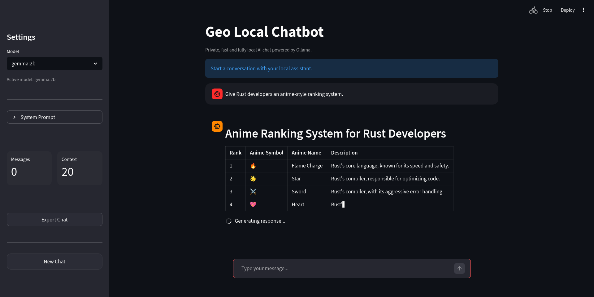

# Geo Local Chatbot

Hey, i'm Geovana.

This is a local AI chatbot I built using Ollama and Streamlit.

The idea was simple:
create a fast, lightweight and fully local chatbot experience without relying on external APIs or cloud services.

Everything runs locally on your machine.

---

## Features

- Fully local AI chat
- Streaming responses
- Persistent chat history
- Dynamic Ollama model selection
- System prompt support
- Markdown chat export
- Minimalist UI
- Local HTTP API integration

---

## Tech Stack

- Python
- Streamlit
- Ollama
- Requests

---

## Preview

### Main Interface


---

## Running the Project

### 1. Clone the repository

```bash
git clone git@github.com:geovanamlf/local-chatbot.git
cd local-chatbot
```

### 2. Create a virtual environment

```bash
python3 -m venv venv
source venv/bin/activate
```

### 3. Install dependencies

```bash
pip install -r requirements.txt
```

### 4. Install Ollama

Download Ollama:

https://ollama.com/download

Then pull a model:

```bash
ollama pull gemma:2b
```

### 5. Run the chatbot

```bash
streamlit run chatbot.py
```

---

## About

This project started as a small experiment to better understand local LLMs and how to build a clean interface around them.

Over time, I kept improving it while trying to keep the original idea:
a simple, private and fast local chatbot.